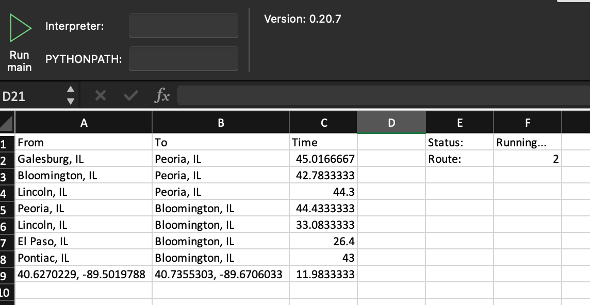

# Waze-Traffic-Calculator --- VBA Branch
#### The one-stop-shop for all your HOI traffic time needs

## About

Built using:

- Python 3
- Python Package [Waze Route Caclulator](https://github.com/kovacsbalu/WazeRouteCalculator)
- [My Brain](https://github.com/jd2012)
- Python Package [xlwings](https://www.xlwings.org/)
- Python Package [PyAutoGUI](https://pyautogui.readthedocs.io/en/latest/)

...but mostly my brain.

---

##### Built for the best and most accurate meteorologist in world. Check out her work at [Heart of Illinois ABC](https://www.hoiabc.com/weather)

---

## What It Do

Using the xlwings Excel Add-in, the program request the travel time betweeen the locations bellow through the Waze API (via WazeRouteCalculator) and populates an Excel sheet with the results.  

| From                                           | To                                             |
| ---------------------------------------------- | ---------------------------------------------- |
| Galesburg, IL                                  | Peoria, IL                                     |
| Bloomington, IL                                | Peoria, IL                                     |
| Lincoln, IL                                    | Peoria, IL                                     |
| Peoria, IL                                     | Bloomington, IL                                |
| Lincoln, IL                                    | Bloomington, IL                                |
| Lincoln, IL                                    | Bloomington, IL                                |
| Pontiac, IL                                    | Bloomington, IL                                |
| 40.6270229, -89.5019788                        | 40.7355303, -89.6706033                        |

## Why It Cool

- I buit it
- ~~It works~~ sorta

